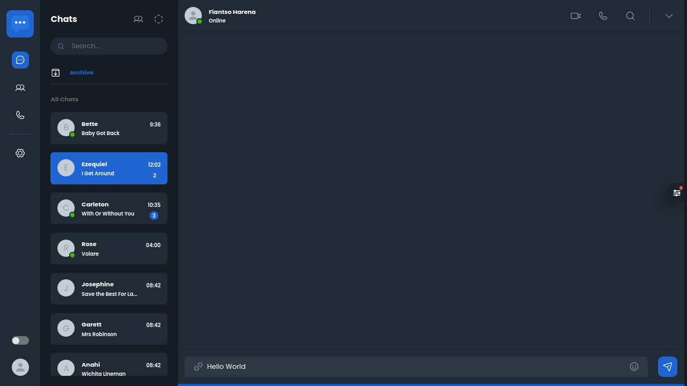

# Chatty 🚀

Chatty is a messaging application built with React that combines the features of Messenger and WhatsApp. This repository contains the source code for the Chatty user interface. Please note that the API component is still under development and will be added in the future.

 

## Table of Contents

- [Features](#features)
- [Installation](#installation)
- [Usage](#usage)
- [Contributing](#contributing)

## Features

- User-friendly interface using [Material UI v5](https://mui.com/material-ui/)
- Messaging functionality
- Fusion of Messenger and WhatsApp features

## Installation

1. Clone the repository:
   ```bash
   git clone https://github.com/HarenaFiantso/chatty-ui.git
   ```
2. Navigate to the project directory:
   ```bash
   cd chatty-ui
   ```
3. Install dependencies:
   ```bash
   npm install
   ```

## Usage

1. Start the development server:
   ```bash
   npm run dev
   ```
2. Open your browser and visit [http://localhost:5173](http://localhost:5173) to view Chatty locally on you browser.

## Contributing

If you'd like to contribute to Chatty, please follow these steps:

1. Fork the repository.
2. Create a new branch for your feature or bug fix:
   ```bash
   git checkout -b feature-name
   ```
3. Make your changes and commit them:
   ```bash
   git commit -m "Description of your changes"
   ```
4. Push your changes to your fork:
   ```bash
   git push origin feature-name
   ```
5. Open a pull request on the main repository.


**Happy chatting! 🎈**
